# Excel_Data_Cleaning_Tutorial

This tutorial is aimed at beginners such as myself who are new to Data Analytics or have some experience and want a refresher on the basics of cleaning with Excel. 

I will have a version explaining the entire thought process from start to finish working with a fresh data set and an abridged version if you only want to see the actual cleaning steps.

I retrieved a sample of uncleaned data from Kaggle which was posted for the purposes of data cleaning. I might go back and see how other users approached it and include any tips or commands that could provide value to your Data Analytics toolbelt in another section.

Introduction: What is Data Analysis? Why clean data?
Data Analysis is "the process of inspecting, cleansing, transforming, and modeling data with the goal of discovering useful information, informing conclusions, and supporting decision-making". Simply put it's looking at raw information, organizing it, studying it, and hopefully obtaining useful information to help guide better decision making. We do this in everyday life but on a much smaller scale because we simply don't have access to millions of instances of a particular event from unbiased sources. 
You will always remember your best friend growing up, the teachers and mentors who made an impact, your first job, your first relationship, your successes and your failures. Everything you perceive in the world is through your own lens, based on your own experiences or the people around you.
The job of a Data Analyst is to look at these events and understand the story from a third party's perspective. We seek to understand the facts. (Yes, that person at the bar last week was indeed flirting with you.)

What are the different types of data files?
Excel is capable of handling various types of files but the focus of this tutorial will be on .csv, .txt, and .xlsx. .Xlsx is the default format for a workbook in Excel. A .csv file is known as a Comma-separated values file, meaning if you were to open a notepad in Windows and type in a string like "Meal, Date, Calories, Cost, Worth" and on the next line "Burgers, 01/01/2025, 700, $33.76, No", saved it as a .csv, then opened it in Excel you would get the following:
 
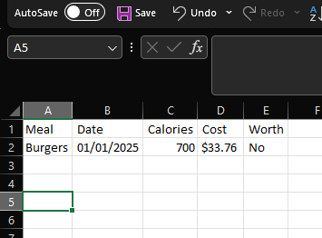
 
Simply put, in a .csv file, the commas separate data values into columns, while a new line constitutes a record or a row. If you save it as a csv but there are no commas in the file, then each line will represent a record but there will only be one column. A .txt file is a text file with or without commas. When you try to open this in Excel it will ask you how you want to separate/format your data. If it does not have separators Excel will try to auto-format the data usually by spaces or fixed width. Obviously this can lead to data not being contained in the appropriate column and being hard to work with.
 
Step 1: Define the Problem or Question
You need to understand the problem before you can come up with a solution. This is in my opinion the most important step as it directs the rest of your efforts moving forward. If you have a bad hypothesis and spend hours of your time setting up pipelines and gathering data that is irrelevant to the problem you're studying it will show in your final result. If you don't know where to start it's recommended you become somewhat familiar with the subject matter and be able to define or understand the variables that determine success (and/or failure).
 
The dataset we are working with contains information scraped from IMDB regarding the "top" Netflix movies and TV shows.
With just the basic understanding of what should be in this data file I can begin cleaning it. First we need to load the .csv file into Excel. You can open the file in notepad first to see if it's at least formatted correctly using comma seperators.
 
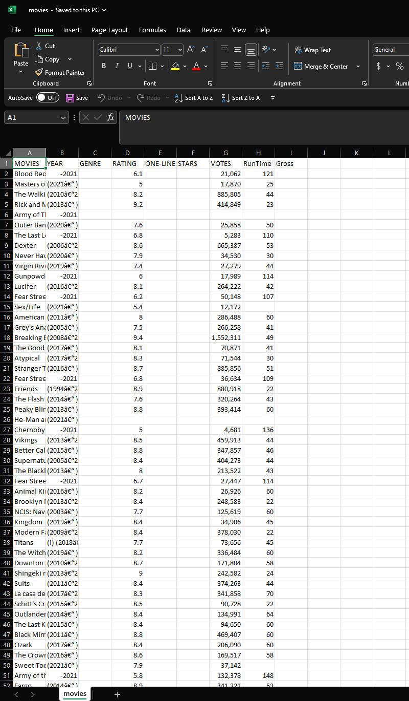
 
Excel allows 1,048,576 rows of data and 16,384 columns of data to be viewed on any given sheet. A workbook is comprised of X amount of sheets. If the csv or xlsx file you are trying to view is comprised of more than the maximum number of records Excel will automatically truncate the dataset to fit in the sheet view meaning you will lose some data. In order to get around this you will need to Load it as a connection so that you can access all the data.
 
You can see the number of records and various summary statistics for any given row, column, or range in the bottom right. Excel uses 1-based indexing (first record/column is 1) when viewing records but 0-based indexing (first record/column is 0) in certain functions. Just something to be aware of when querying. Since our first row are headers we know that there are 9,999 records.
 

 
So now that we have everything set up it's time to understand what it is we're actually looking at to determine our next steps. We know there are roughly ten thousand rows of data pertaining to movies with the headers "MOVIES	YEAR GENRE RATING	ONE-LINE STARS VOTES RunTime Gross". Sometimes datasets on Kaggle come with detailed descriptions of what each column represents in case there is any confusion. Luckily this did not so we'll have to infer what each column means. In a more high-stakes environment I would definitely recommend getting a source-verified description of a record. 

 ***IMPORTANT*** 

Before you begin defining the columns expand everything to a pre-formatted view. Select any value within the range and press Ctrl + A to select the entire range followed by Alt + H + O + I and Alt + H + O + A (hold alt but the letters can be pressed individually, sequentially). Alternatively click the top left icon above the first row and double click the width/height modifier on any column and or row. If it doesn't work make sure you have everything selected as indicated by green highlighted rows and columns.
 
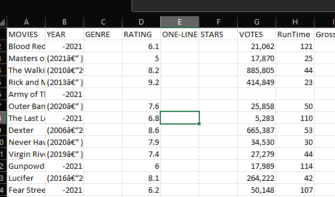
 
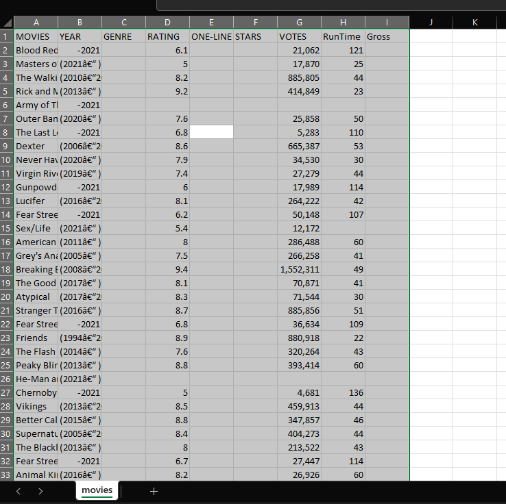
 
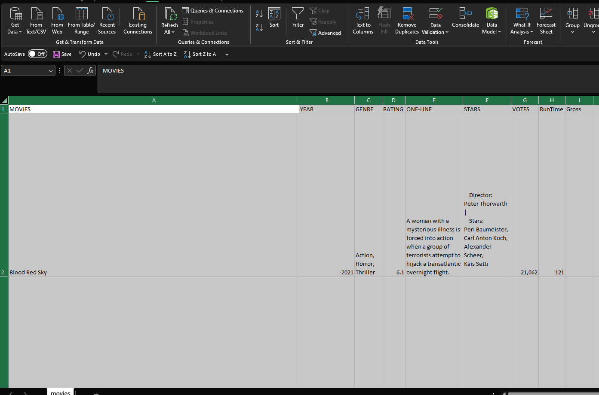
 

Okay let's visually inspect the columns, on initial inspection we see that:

 **Movies** = Title of the movie

 **Year** = Year released (Ordinal value)

 **Genre** = Classified Genre (Nominal, could be used for popularity or ranking)

 **Rating** = The rating given by User? Overall? Critic? (We'll have to check on this)

 **One-line** = One-line description of movie (Could be used in phrase analysis to identify movies having similar plots vs reviews, it's a stretch)

 **Stars** = Who is in the movie, some records include directors while others only list actors (Interesting to see average rating of movies for certain celebrities and directors, even though it's based on an entirely subjective scale)

 **Votes** = Total votes (Votes by whom and what context. Votes for Actor, Director, Cinematography, Hair, Amount of hand lotion used by cameramen? Best use of funfetti on the cupcakes at craft services? What does Votes mean and who are casting them?)

 **Runtime** = How long the movie was in minutes

 **Gross** = Gross revenue generated from box office

 
Unfortunately the first run through left me without a clear understanding of some of the column values. I shouldn't _assume_ I understand the meaning of certain columns since that could _impact my results_ and lead me to _misrepresent data_ as something other than what it was intended.
Let's see if we can find a glossary on the IMDB(source-verified) website to clarify.
 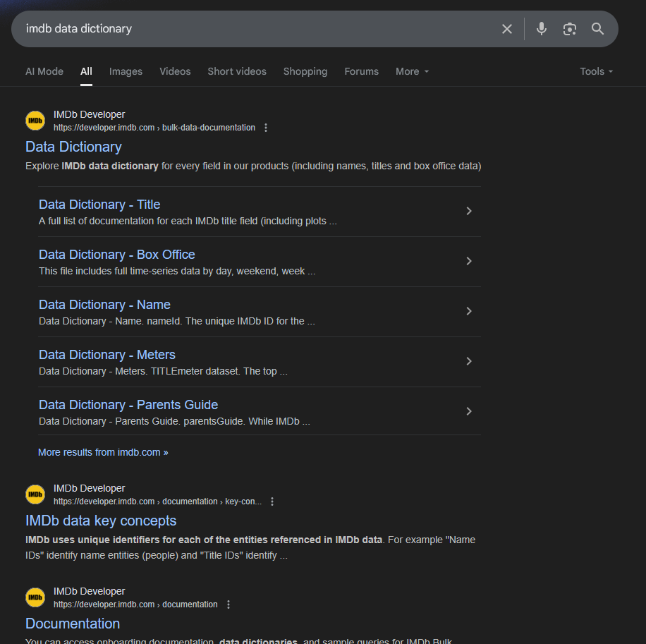
 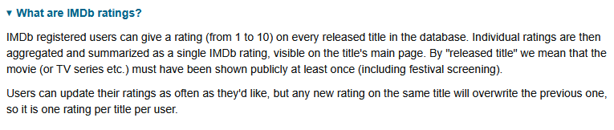
 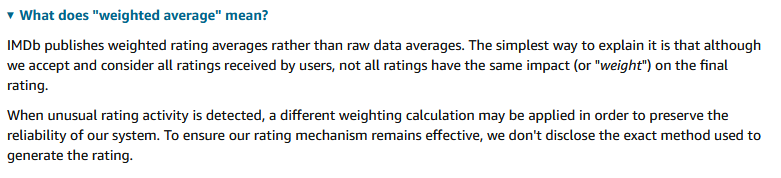
 
Now we have a better understanding of the columns and what they represent. So finally we can say the dataset is comprised of user-submitted reviews for Netflix Movies and TV shows on IMDB. The person who submitted this dataset included the word "top" to describe this list, however seeing as there are ten thousand records I am curious about their definition.
What does this data provide and what can we hope to gain from it? As you can see, as I was performing the initial steps of preparing the data I already had some questions in mind as I skimmed through the records. If I were to scrape this data myself or used an API, the process would have been similar only I would have known what I was trying to collect beforehand. Here I'm simply understanding the data as if it was a report handed to me, or requested from a different department. 
 
So now that we have some direction let's get to actually cleaning the data. You could try to clean the data in the sheet itself or save yourself some time and use PowerQuery which will provide a lot more visual clarity.
Begin by loading the data into PowerQuery like so:
 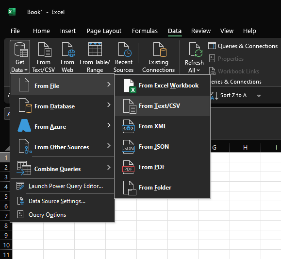
 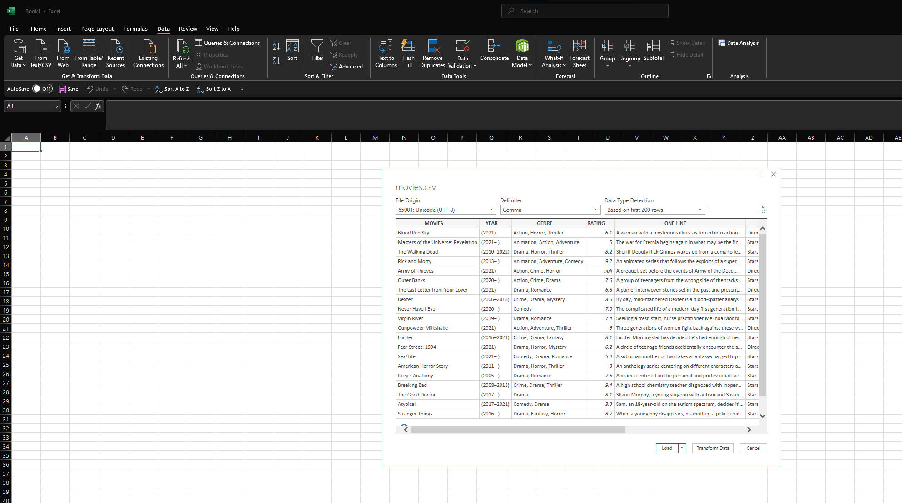
 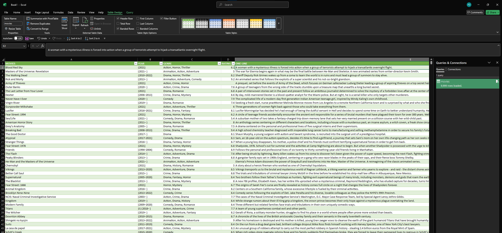

Next take a look at the columns and understand the formatting. We won't be able to do much with the YEAR column as it is formatted in such a way that makes it hard to select a single value and the parentheses add an additional level of clutter that doesn't look nice on visuals. We'll strip it down by using the REPLACE function. In PowerQuery select the YEAR column and right click the column and find the 'Replace values' button. We strip "(", ")", "I", and "TV Special".  We're left with the following:

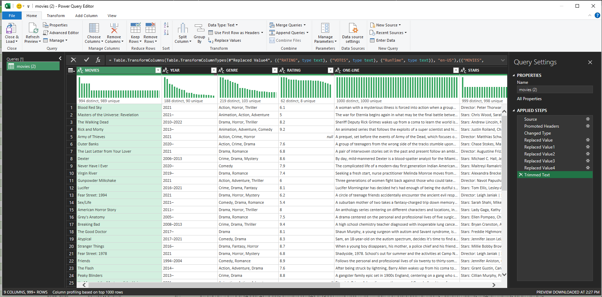

Since I don't know what other characters are included that could mess up the querying, I examine the values by using the down arrow next to the column name. Use the load more option to see all values.

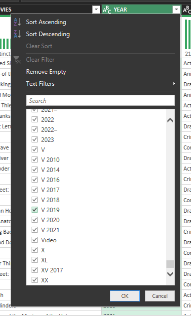
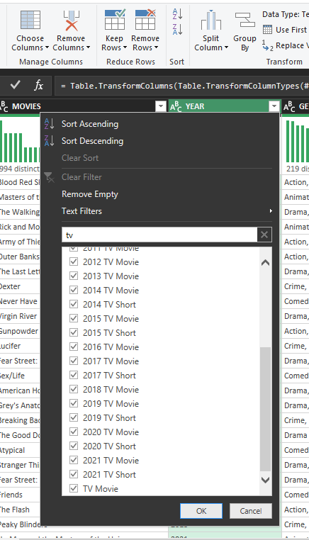
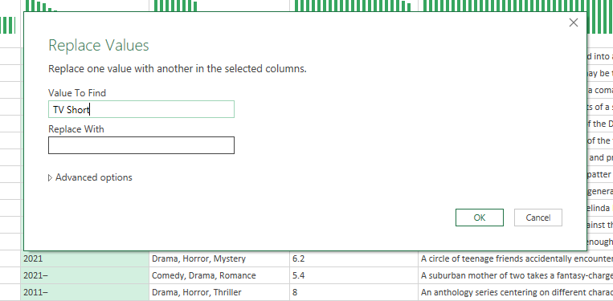

The final cleaned column should look like this:

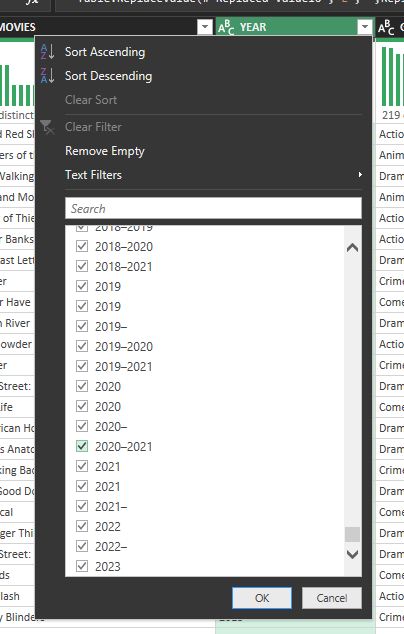

Now it's time to separate the start year and end year in case we want to do some analysis on that. We highlight the column and under the Home tab select split column. We use a custom delimiter specifying we want to split the string at the '-', keeping the first 5 characters. The reason I did this was because I want to create an additional column to essentially keep track of ongoing tv shows. We know that if the year column includes a '-' but no end year, it is because the series has not ended yet.

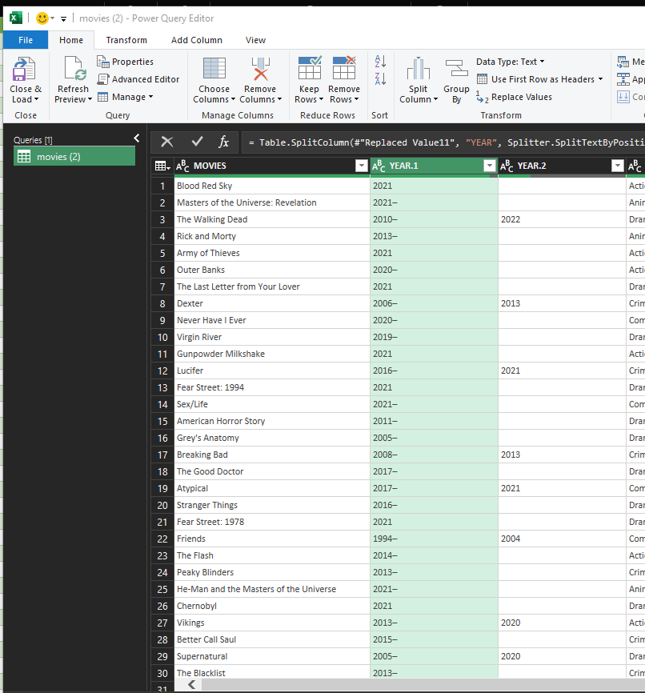

I select Add Custom Column and enter the following formula: =if Text.Contains([YEAR.1], "–") and ([YEAR.2] = null or [YEAR.2] = "") then "Ongoing" else "Finished") which is saying "If the string in the YEAR.1 column contains a hyphen AND the YEAR.2 column does not contain any value or is 'null' (meaning no end date), THEN it is "Ongoing", otherwise it is "Finished".

Finally I want to separate the STARS column into Directors and Actors for future queries. This would allow me to run a command in SQL or Python to return things such as "What was X director's/actor's highest rated movie/tv show by ratings AND votes". Since some directors also star in their own films you could filter that as well.
Again we Add Custom Column and use a function to strip the information we are looking for. 

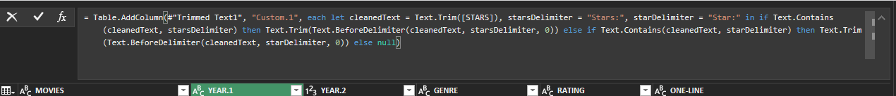
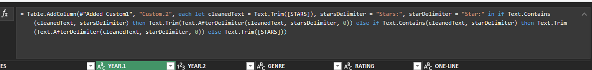

The query is essentially identically only I am telling PowerQuery WHERE I want to return the values from by using Text.AfterDelimiter and Text.BeforeDelimiter. You'll notice that I had specify 2 variables since some movies only contained one star.
After applying the formulas we're left with

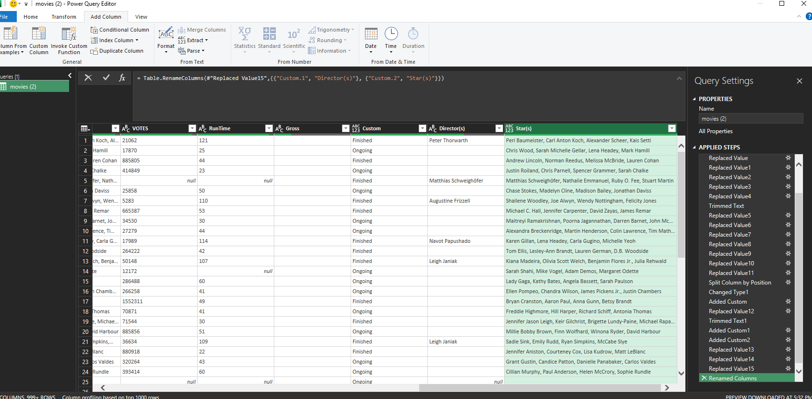

You could TRIM the entire workbook to remove trailing or leading spaces and have a much more presentable dataset. I personally chose to fill in the blank spaces with "N/A" but that is up to you. Some datasets will have missing values and you'll have to use your best judgement because defaulting to "0" might skew your data especially when looking at averages.

With that we could perform some EDA with Excel but I would much rather use SQL or Python as I would be able to perform multiple queries at once. Save the file as a separate file from the original so you have a restore point in case you need to undo something or restart your project. 

